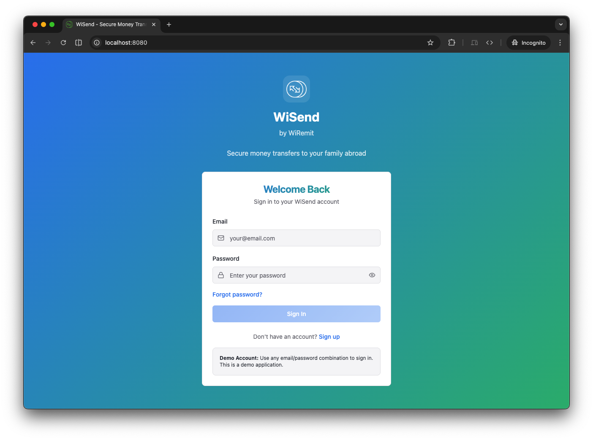
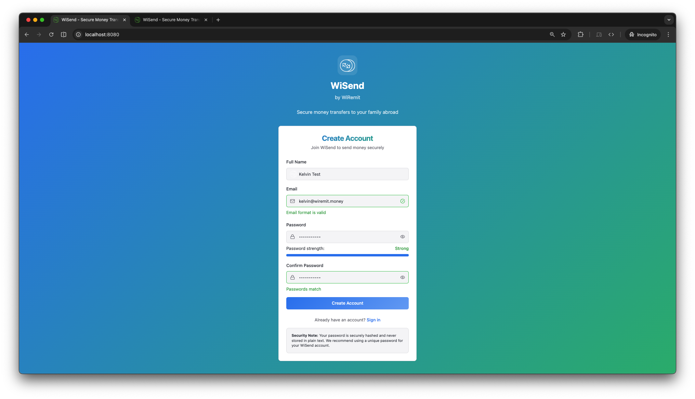
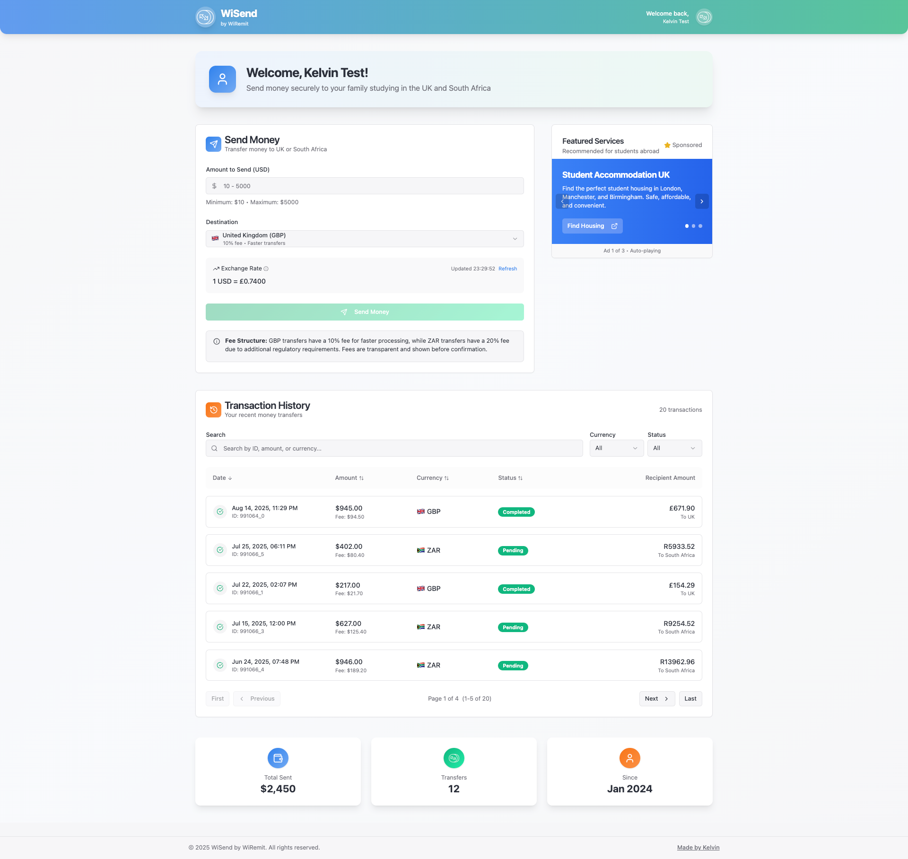

# WiSend - Secure Money Transfers

A modern web application for secure money transfers, built by WiRemit.
You can try out a [live demo of WiSend here](https://wisend.netlify.app).

## About WiSend

WiSend is a secure money transfer platform that allows users to send money to their family members studying in the UK and South Africa. The application provides real-time exchange rates, low fees, and a trusted platform for international money transfers.

## Live Demo

You can try out a live demo of WiSend.

[**WiSend Live Demo**](https://wisend.netlify.app)

## Screenshots

Here are a few screenshots of the application in action. These will be updated with actual images of the application.

**Login Page**


**Sign Up Page**


**User Dashboard**


## Features

- **Secure Authentication**: User registration and login with secure authentication
- **Money Transfers**: Send money to family members abroad with real-time exchange rates
- **Transaction History**: Track all your transfer history and status
- **Dashboard**: Comprehensive dashboard with transfer statistics and quick actions
- **Responsive Design**: Modern, mobile-friendly interface built with React and Tailwind CSS

## Techn Stack

This project is built with:

- **Frontend**: React 18 with TypeScript
- **UI Framework**: shadcn/ui components
- **Styling**: Tailwind CSS
- **Build Tool**: Vite
- **Routing**: React Router DOM
- **State Management**: React Query for server state
- **Forms**: React Hook Form with Zod validation
- **Icons**: Lucide React

## Getting Started

### Prerequisites

- Node.js (version 18 or higher)
- npm or yarn package manager

### Installation

1. Clone the repo:
```bash
git clone https://github.com/kelvinelove/wisend.git
cd wisend
```

2. Install dependencies:
```bash
npm i
```

3. Start the development server:
```bash
npm run dev
```

4. Open your browser and navigate to `http://localhost:8080`

### Available Scripts

- `npm run dev` - Start development server
- `npm run build` - Build for production
- `npm run build:dev` - Build for development
- `npm run preview` - Preview production build
- `npm run lint` - Run ESLint

### How to Log In (Demo Version)

Since this is a demo application, user authentication is handled using your browser's `localStorage`. There is no backend server for this version.

1.  **Navigate to the Register Page**: From the login screen, click on the "Sign up" link at the bottom.
2.  **Create an Account**: Fill in your details (name, email, and password) and click "Create an account". Your credentials will be saved locally in your browser.
3.  **Log In**: After successful registration, you will be redirected to the login page. Use the email and password you just created to sign in.
4.  **Access the Dashboard**: Upon successful login, you will be taken to your personal dashboard where you can start sending money and view your transaction history.

All your account information and transaction history will persist between browser sessions, thanks to `localStorage`.

## Project Structure

```
src/
├── components/          # React components
│   ├── auth/           # Authentication components
│   ├── dashboard/      # Dashboard components
│   └── ui/             # Reusable UI components
├── hooks/              # Custom React hooks
├── lib/                # Utility functions
├── pages/              # Page components
├── services/           # API services
└── main.tsx           # Application entry point
```

## Design Decisions & Architecture

### Account Storage
- User accounts and transactions are stored in `localStorage` for demo purposes. This allows for a persistent experience between reloads without a backend. In production, a secure backend and encrypted storage would be required. We can use something like supabase or appwrite (I prefer this one, personal choice)
- Multiple accounts are supported. Each user is uniquely identified by their email.

### Data Flow & Component Structure
- **AuthContext** provides authentication state and methods to all components.
- **Dashboard** is the main page after login, containing:
  - **SendMoney**: Handles sending money, fee calculation, and FX rates.
  - **AdsCarousel**: Displays at least two rotating mock ads.
  - **TransactionHistory**: Shows paginated, filterable, and sortable transaction history.
- **FX Rates** are fetched from a real API, parsed, and cached for 5 minutes. If the API fails, a mock fallback is used.

### Rounding & Fee Logic
- All transaction fees and recipient amounts are always rounded UP to the nearest cent, as required for financial accuracy.
- Fee structure is transparent and explained in the UI. The design supports future changes (e.g., different fees for new currencies or payment methods).

### Scaling for More Currencies/Countries
- The FX rates service is designed to extract only the needed currencies from the API, but can easily be extended to support more.
- To add a new country/currency: update the currency selector, fee logic, and ensure the FX rates API provides the required rate.
- The UI and data models are flexible for future expansion.

### Security Considerations
- Credentials are stored in localStorage for demo only. In production, use secure, encrypted backend storage and never store plain passwords.
- All user input is validated and sanitized. React escapes output by default, reducing XSS risk.
- No API keys are used; the FX rates API is public for demo.
- No sensitive data is sent over the network.

### Mobile Responsiveness & Accessibility
- The app uses Tailwind CSS and shadcn/ui for responsive layouts.
- All forms and navigation are keyboard accessible.
- ARIA labels and semantic HTML are used for accessibility.
- Color contrast and font sizes are chosen for readability on all devices.

### UI/UX
- Real-time feedback for all user actions (loading, errors, validation).
- Clear navigation and sectioning.
- Tooltips and alerts explain fees, rates, and security.

## How to Add More Currencies or Countries
1. Update the FX rates service to extract the new currency from the API.
2. Add the new currency to the destination selector in SendMoney.
3. Adjust fee logic as needed.
4. Update UI labels and transaction history to support the new currency.

## Contributing

1. Fork the repository
2. Create a feature branch (`git checkout -b feature/amazing-feature`)
3. Commit your changes (`git commit -m 'Add some amazing feature'`)
4. Push to the branch (`git push origin feature/amazing-feature`)
5. Open a Pull Request

## License

This project is...i mean....can be proprietary software owned by WiRemit (if everything works out 🤞).

## Support

For support and questions, please contact [Kelvin and the development team](https://kelvin.is-a.dev).
